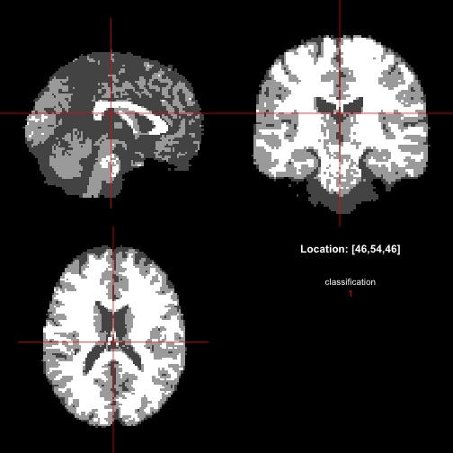

<!-- README.md is generated from README.Rmd. Please edit that file -->


[](https://cran.r-project.org/package=mritc) [](https://github.com/jonclayden/mritc/actions/workflows/ci.yaml) [](https://codecov.io/gh/jonclayden/mritc) [](https://cran.r-project.org/package=mritc)

# mritc: MRI Tissue Classification in R

`mritc` classifies the voxels of a structural brain magnetic resonance image into cerebrospinal fluid (CSF), gray matter (GM) and white matter (WM), using normal mixture models and hidden Markov normal mixture models. Several fitting methods are provided, from a plain EM algorithm through to Markov-chain Monte Carlo approaches that also address the partial volume effect (where a voxel contains a mixture of tissue types) and intensity non-uniformity (smoothly varying bias in the scanner signal). The methods are described in [Feng & Tierney (2011)](https://doi.org/10.18637/jss.v044.i07).

## Installation

You can install `mritc` from CRAN with


``` r
install.packages("mritc")
```

or the development version from GitHub with


``` r
# install.packages("remotes")
remotes::install_github("jonclayden/mritc")
```

## Usage

The package includes a sample T1-weighted structural image and a corresponding brain mask, which we can use to demonstrate tissue classification.


``` r
library(mritc)

t1 <- readMRI(system.file("extdata", "t1.rawb.gz", package="mritc"),
              dim=c(91,109,91), format="rawb.gz")
mask <- readMRI(system.file("extdata", "mask.rawb.gz", package="mritc"),
                 dim=c(91,109,91), format="rawb.gz")

tc <- mritc(t1, mask, method="ICM", verbose=FALSE)
tc
## Using method ICM, among 237067 voxels, 
## 18% are classified to CSF,
## 45% are classified to GM,
## 37% are classified to WM.
```

In this case the images are stored in a simple binary format, requiring the dimensions to be specified, but `readMRI()` can also handle NIfTI or ANALYZE files, or numeric arrays read by other packages can be passed in.

The `mritc()` function is an interface to the various classification methods available within the package, selected with its "method" argument. The mask limits classification to within the brain.

The `summary()` method gives a little more detail on the fitted intensity distribution for each tissue type:


``` r
summary(tc)
## Using method ICM, the results are: 
##     proportion%   mean standard deviation
## CSF          18  48.02              13.34
## GM           45  94.35              10.48
## WM           37 128.31              10.32
```

The `plot()` method shows the classified image, overlaid with the tissue label at
each voxel (0 = outside the brain mask, 1 = CSF, 2 = GM, 3 = WM). By default since package version 0.6.0, this uses the viewer from [the `RNifti` package](https://github.com/jonclayden/RNifti); previously [`misc3d::slices3d()`](https://gitlab.com/luke-tierney/misc3d) was used, and this remains an option, although it requires system support for Tk.


``` r
plot(tc, interactive=FALSE)
```



### Checking accuracy against ground truth

The package also bundles the "true" partial volume fractions for this image,
which can be compared to the fitted probabilities using `measureMRI()`. This
reports the mean squared error, misclassification rate, relative volume
error and Dice similarity for each tissue type, and a confusion table.


``` r
csf <- readMRI(system.file("extdata", "csf.rawb.gz", package="mritc"),
               dim=c(91,109,91), format="rawb.gz")
gm <- readMRI(system.file("extdata", "gm.rawb.gz", package="mritc"),
              dim=c(91,109,91), format="rawb.gz")
wm <- readMRI(system.file("extdata", "wm.rawb.gz", package="mritc"),
              dim=c(91,109,91), format="rawb.gz")
truth <- cbind(csf[mask==1], gm[mask==1], wm[mask==1]) / 255

measureMRI(actual=truth, pre=tc$prob)
## $mse
## [1] 0.03309548
## 
## $misclass
## [1] 0.09494362
## 
## $rseVolume
## [1] 0.04655948 0.03611199 0.02440557
## 
## $DSM
## [1] 0.9139096 0.8968206 0.9111253
## 
## $conTable
##              [,1]       [,2]       [,3]
## [1,] 0.9351851852 0.04197286 0.00000000
## [2,] 0.0639774141 0.88062756 0.07775644
## [3,] 0.0008374007 0.07739958 0.92224356
```

See `?mritc` for the other fitting methods available, and `?mritc-package`
for more background on the underlying models.
